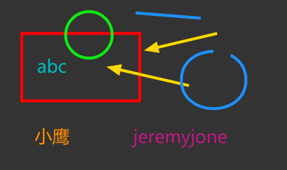

# JavaScript 之 Canvas

## 示例

[https://jeremyjone.github.io/CanvasPaint/example/index.html](https://jeremyjone.github.io/CanvasPaint/example/index.html)，这是一个完整的 demo，原码在 example 中。

## 介绍

根据该系列，最后成品是这个样子滴：

我已经将代码按照系列编号拆分开，有需要的朋友可以自行查看。

本示例具有：

- [x] 随意画
- [x] 直线
- [x] 箭头
- [x] 矩形

  - 实心 / 空心
  - 正方形 / 长方形

- [x] 圆

  - 实心 / 空心
  - 正圆 / 椭圆

- [x] 文字
- [x] 橡皮

- [x] 画笔大小
- [x] 画笔颜色

## 使用方法

在`base.html`中可以导入 js 文件以使用。
